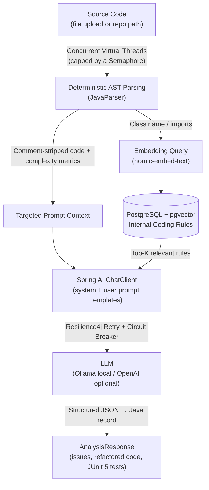

# 🤖 CodeSentinel

An automated **Enterprise Code Review & Refactoring Engine** that bridges deterministic **Abstract Syntax Tree (AST) parsing** with **Generative AI**.

This project showcases production-grade architecture combining **Java virtual threads**, **Spring AI (RAG)**, and **Resilience4j fault tolerance** to analyze codebases concurrently, flag vulnerabilities, and generate JUnit 5 test suites locally.

---

## 🚀 Technical Highlights & Skills Showcased

*   **High-Throughput Concurrency (Project Loom):** Leverages `Executors.newVirtualThreadPerTaskExecutor()` to fan out analysis across thousands of files concurrently without exhausting OS threads, managed safely via tokenized `Semaphore` backpressure.
*   **AST Analysis & Token Optimization:** Integrates **JavaParser** to extract class metadata, calculate McCabe cyclomatic complexity, and perform AST token optimization by stripping comments before pushing payload to the LLM.
*   **Retrieval-Augmented Generation (RAG):** Implements Spring AI's `VectorStore` over **PostgreSQL (pgvector)** to store custom organizational style guides and dynamically inject top-K relevant rules into targeted prompts.
*   **Structured AI Outputs:** Utilizes Spring AI `ChatClient` entity mapping (`BeanOutputConverter`) to enforce a typed JSON schema that binds LLM outputs directly into immutable **Java Records**.
*   **Fault Tolerance & Resilience:** Implements multi-layered resilience using **Resilience4j** (Retry wrapper and Circuit Breaker pattern) to handle local LLM drops elegantly with graceful degradation fallbacks.

---

## 🏗️ Architecture Flow



---

## 🛠️ Tech Stack

*   **Runtime & Framework:** Java 26+ Bytecode, Spring Boot 4.x (Spring 7, Jackson 3)
*   **AI & Vector Layer:** Spring AI 2.x, PostgreSQL 18 with pgvector 0.8.x
*   **Local LLM Engine:** Ollama (`qwen2.5-coder` & `nomic-embed-text`)
*   **Resilience & Tooling:** Resilience4j, JavaParser, Maven, Testcontainers, GitHub Actions

---

## 🚦 Quick Start & Demo API

### 1. Fire up the Stack
```bash
docker compose -f docker/docker-compose.yml up -d
mvn spring-boot:run
```

### 2. Ingest Enterprise Style Guides (RAG)
```bash
curl -X POST -F "file=@documents/team-rules.md" http://localhost:8080/api/v1/rules/ingest
```

### 3. Analyze and Refactor Code
```bash
curl -s -X POST -F "file=@samples/LegacyCode.java" http://localhost:8080/api/v1/agent/analyze | jq
```

**Expected API Response Schema:**
```json
{
  "fileName": "LegacyCode.java",
  "metrics": { "className": "LegacyCode", "packageName": "", "methods": [{ "name": "findUser", "complexity": 4 }] },
  "sourceReductionPercent": 42.5,
  "response": {
    "summary": "SQL injection and unclosed resource leaks detected.",
    "issues": [
      { "severity": "CRITICAL", "category": "SECURITY", "location": "findUser", "description": "SQL built by string concatenation.", "suggestion": "Use PreparedStatement placeholders." }
    ],
    "refactoredCode": "public class LegacyCode { ... }",
    "junitTests": "class LegacyCodeTest { ... }"
  },
  "error": null
}
```

---

## 📈 Key Metrics & Evaluation Goals

*   **Token Optimization:** Consistently achieves over 40% token context reduction via AST comment stripping on heavily commented legacy applications.
*   **Thread Saturation:** Repository scan performance is bounded strictly by model processing speeds rather than the JVM, thanks to Virtual Thread scheduling.
